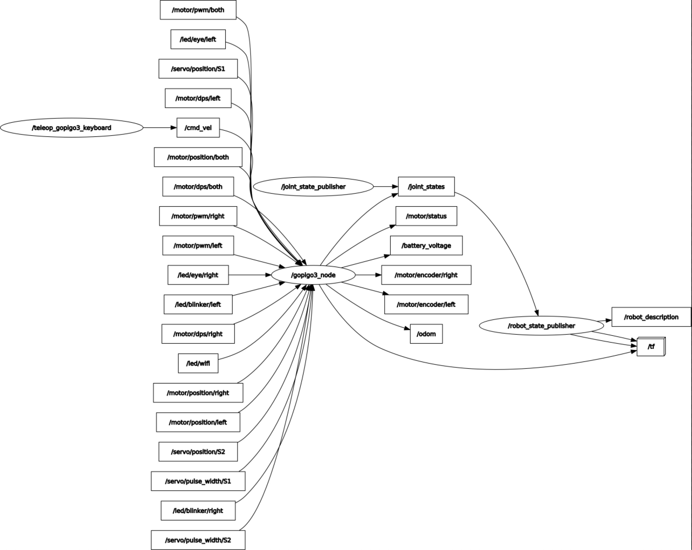

# Test_ROS2_GoPiGo3
Test and learn about the ROS2 GoPiGo3 

## ALL TESTS ASSUME REMOTE LOGIN:  
- ssh ubuntu@x.x.x.x  
  password: robots1234 (if not changed during installation steps)  

## AND EXECUTION FROM ~/ros2ws:
- cd ros2ws

## IF YOUR BOT STARTS RUNNING OFF - type ```stop```
(It sometimes happens mysteriously when shutting down the ROS2 robot nodes...)
  
# View Version Info:
```
./versions.sh
```
  
# TEST 1: Talker - Listener Test
```
1) From "First Remote Shell":
   ./start_demo_talker.sh

2) From "Second Remote Shell":
   ./start_demo_listener.sh
   
3) Control-c in each shell to stop execution   
```


# TEST 2: ROS2 GoPiGo3 REMOTE CONTROL

1) From "First Remote Shell":  
   ./start_robot_gpgMin.sh  
   
2) From "Second Remote Shell":  
   ./run_teleop_gopigo3_keyboard.sh  
```
This node takes keypresses from the keyboard and publishes them  
as Twist messages. It works best with a US keyboard layout.  

Moving around:
   u    i    o
   j    k    l
   m    ,    .

  and arrow keys:  

        ^  
  <--   v  -->  

anything else : stop  (space-bar is convenient stop)  

q/z : increase/decrease max speeds by 10%
w/x : increase/decrease only linear speed by 10%
e/c : increase/decrease only angular speed by 10%
```
- i : Moves forward  
- k : STOP MOTION    <---- Space Bar is also good for this  
- , : Moves backward  
- j : Spin Left  
- l : Spin Right  
- u : "Turns" Left (Forward + Rotation)  
- o : "Turns" Right (Forward + Rotation)  
- m : "Turns" Clockwise In Reverse  
- . : "Turns" Counter-Clockwise In Reverse  
 
CTRL-C to quit remote control - (does not kill ROS2 GoPiGo3 Nodes)  

3) From either shell (if do not see shell prompt, press CTRL-C in that shell):   
   ./stop_robot.sh  
   (Ignore any errors - Not a problem - investigating)  


# TEST 3:  GETTING TO KNOW THE ROS2 GoPiGo3 NODES
1) From "First Remote Shell":  
   ./start_robot_gpgMin.sh  
   
   (Finmark:  ./start_robot_finmark.sh)  
   (Dave:     ./start_robot_dave.sh)
   
2) From "Second Remote Shell":  
- List Running Nodes
```
   ./list_running_nodes.sh
List running ROS2 nodes
ros2 node list
/gopigo3_node
/joint_state_publisher
/robot_state_publisher
```

- List Active Topics
```
   ./list_active_topics.sh
   
List active ROS2 topics
ros2 topic list                   <--- NOTE: The ROS2 command line for this 
/battery_voltage
/cmd_vel
/joint_states
/led/blinker/left
/led/blinker/right
/led/eye/left
/led/eye/right
/led/wifi
/motor/dps/both
/motor/dps/left
/motor/dps/right
/motor/encoder/left
/motor/encoder/right
/motor/position/both
/motor/position/left
/motor/position/right
/motor/pwm/both
/motor/pwm/left
/motor/pwm/right
/motor/status
/odom
/parameter_events
/robot_description
/rosout
/servo/position/S1
/servo/position/S2
/servo/pulse_width/S1
/servo/pulse_width/S2
/tf
/tf_static
```

Visualization (from rqt_graph on desktop ROS2 environment) of Nodes and Topics For Minimal GoPiGo3 Robot
   


&nbsp;

- List Active Topics (with Topic Type)
```
   ./list_topics_with_type.sh

List active ROS2 topics - With topic TYPE
ros2 topic list -t
/battery_voltage [std_msgs/msg/Float64]
/cmd_vel [geometry_msgs/msg/Twist]
/joint_states [sensor_msgs/msg/JointState]
/led/blinker/left [std_msgs/msg/UInt8]
/led/blinker/right [std_msgs/msg/UInt8]
/led/eye/left [std_msgs/msg/ColorRGBA]
/led/eye/right [std_msgs/msg/ColorRGBA]
/led/wifi [std_msgs/msg/ColorRGBA]
/motor/dps/both [std_msgs/msg/Int16]
/motor/dps/left [std_msgs/msg/Int16]
/motor/dps/right [std_msgs/msg/Int16]
/motor/encoder/left [std_msgs/msg/Float64]
/motor/encoder/right [std_msgs/msg/Float64]
/motor/position/both [std_msgs/msg/Int16]
/motor/position/left [std_msgs/msg/Int16]
/motor/position/right [std_msgs/msg/Int16]
/motor/pwm/both [std_msgs/msg/Int8]
/motor/pwm/left [std_msgs/msg/Int8]
/motor/pwm/right [std_msgs/msg/Int8]
/motor/status [ros2_gopigo3_msg/msg/MotorStatusLR]
/odom [nav_msgs/msg/Odometry]
/parameter_events [rcl_interfaces/msg/ParameterEvent]
/robot_description [std_msgs/msg/String]
/rosout [rcl_interfaces/msg/Log]
/servo/position/S1 [std_msgs/msg/Float64]
/servo/position/S2 [std_msgs/msg/Float64]
/servo/pulse_width/S1 [std_msgs/msg/Int16]
/servo/pulse_width/S2 [std_msgs/msg/Int16]
/tf [tf2_msgs/msg/TFMessage]
/tf_static [tf2_msgs/msg/TFMessage]

```

- Show /gopigo3_node Info:
```
   ./show_gopigo3_node_info.sh
   
GoPiGo3 Node Info
ros2 node info /gopigo3_node
/gopigo3_node
  Subscribers:
    /cmd_vel: geometry_msgs/msg/Twist
    /led/blinker/left: std_msgs/msg/UInt8
    /led/blinker/right: std_msgs/msg/UInt8
    /led/eye/left: std_msgs/msg/ColorRGBA
    /led/eye/right: std_msgs/msg/ColorRGBA
    /led/wifi: std_msgs/msg/ColorRGBA
    /motor/dps/both: std_msgs/msg/Int16
    /motor/dps/left: std_msgs/msg/Int16
    /motor/dps/right: std_msgs/msg/Int16
    /motor/position/both: std_msgs/msg/Int16
    /motor/position/left: std_msgs/msg/Int16
    /motor/position/right: std_msgs/msg/Int16
    /motor/pwm/both: std_msgs/msg/Int8
    /motor/pwm/left: std_msgs/msg/Int8
    /motor/pwm/right: std_msgs/msg/Int8
    /servo/position/S1: std_msgs/msg/Float64
    /servo/position/S2: std_msgs/msg/Float64
    /servo/pulse_width/S1: std_msgs/msg/Int16
    /servo/pulse_width/S2: std_msgs/msg/Int16
  Publishers:
    /battery_voltage: std_msgs/msg/Float64
    /joint_states: sensor_msgs/msg/JointState
    /motor/encoder/left: std_msgs/msg/Float64
    /motor/encoder/right: std_msgs/msg/Float64
    /motor/status: ros2_gopigo3_msg/msg/MotorStatusLR
    /odom: nav_msgs/msg/Odometry
    /parameter_events: rcl_interfaces/msg/ParameterEvent
    /rosout: rcl_interfaces/msg/Log
    /tf: tf2_msgs/msg/TFMessage
  Service Servers:
    /gopigo3_node/describe_parameters: rcl_interfaces/srv/DescribeParameters
    /gopigo3_node/get_parameter_types: rcl_interfaces/srv/GetParameterTypes
    /gopigo3_node/get_parameters: rcl_interfaces/srv/GetParameters
    /gopigo3_node/list_parameters: rcl_interfaces/srv/ListParameters
    /gopigo3_node/set_parameters: rcl_interfaces/srv/SetParameters
    /gopigo3_node/set_parameters_atomically: rcl_interfaces/srv/SetParametersAtomically
    /odom/reset: std_srvs/srv/Trigger
    /power/off: std_srvs/srv/Trigger
    /power/on: std_srvs/srv/Trigger
    /reset: std_srvs/srv/Trigger
    /spi: ros2_gopigo3_msg/srv/SPI
  Service Clients:

  Action Servers:

  Action Clients:
   
```


- Show some data topics
```
   ./echo_battery_voltage.sh
   
*** Capturing one battery voltage topic
*** ros2 topic echo --once /battery_voltage
data: 10.08
---


./echo_odom_topic.sh 

*** Capturing one odometer topic (flow-style):
*** ros2 topic echo --once --flow-style /odom
header:
  stamp:
    sec: 1667491458
    nanosec: 341272571
  frame_id: odom
child_frame_id: base_link
pose:
  pose:
    position:
      x: 0.0
      y: 0.0
      z: 0.0
    orientation:
      x: 0.0
      y: 0.0
      z: 0.0
      w: 1.0
      ...
      
---

```
# TEST 3 - MONITOR MEMORY AND CPU 

- In a separate ssh shell: Type ```./monitor.sh```  

```
********** ROS2 GoPiGo3 MONITOR ******************************
Thursday 11/03/22
 17:59:20 up 6 min,  3 users,  load average: 0.49, 0.44, 0.22
temp=44.8'C
frequency(48)=1300324224
throttled=0x0
               total        used        free      shared  buff/cache   available
Mem:           1.8Gi       308Mi       1.2Gi        10Mi       300Mi       1.3Gi
Swap:             0B          0B          0B             <<<----- SWAP FIX NOT APPLIED??
GoPiGo3 Battery Voltage: 11.3 volts

```

If swap is properly set up, should see 1.0Gi total swap:
```
********** ROS2 GoPiGo3 MONITOR ******************************
Monday 11/28/22
 09:12:38 up 1 min,  1 user,  load average: 1.03, 0.39, 0.14
temp=32.6'C
frequency(48)=1300324224
throttled=0x0
               total        used        free      shared  buff/cache   available
Mem:           1.8Gi       176Mi       1.4Gi       7.0Mi       260Mi       1.5Gi
Swap:          1.0Gi          0B       1.0Gi                  <<<----- SWAP PROPERLY SETUP
GoPiGo3 Battery Voltage: 11.9 volts
```

# TEST 4 - (If your GoPiGo3 has a "Servo 1"): PUBLISHING COMMAND TOPICS TO THE ROS2 GOPIGO3  

- Publish a data topic the GoPiGo3 node is subscribed to:  
```
   Center Servo:  ./pub_center_servo.sh
   
   Servo right: ./pub_servo_right_45.sh
   
```

# SHUTTING DOWN THE ROS2 GoPiGo3 NODES  
- ```cd ~/ros2ws```  
- Type ```./stop_robot.sh``` to shutdown nodes running in the background  
- Confirm with ```./list_running_nodes.sh```  (Repeat if some nodes have not shutdown yet.)  

# SHUTTING DOWN THE GoPiGo3 ROBOT 
- Confirm no ROS2 nodes are running with ```./list_running_nodes.sh```  
- Press the power button (below the Green LED)

# TUNING THE ROS2 GoPiGo3  
The GoPiGo3 has a nominal wheel-diameter of 66.5mm and wheel-base of 117mm.  
Tuning these values will result in more accurate odometry position and heading estimates.  
Follow the steps in [Tuning The ROS2 GoPiGo3](Tuning_ROS2_GoPiGo3.md)  

# INFO: LOG LOCATIONS  
- ROS2 Node Execution Logs:  ~/ros2ws/roslogs   
- COLCON Build Logs: ~/ros2ws/log  

# INFO: LIST OF ALL HELPER SCRIPTS IN ~/ros2ws/  

[See Reference](Reference.md)

# === ADVANCED USERS:

## Check LIDAR Scan Reliability  
For a robot that has YDLIDAR X4 with motor closest to front of robot:  
1) Place the robot in its "playground"   
such that distance to left, right, front, and rear walls or obstacle is greater than 12cm and less than 10 meters  

Those distances are from /scan.range_min and /scan.range_max which ```./echo_lidar_topic.sh``` will show:  
```
ubuntu@ROS2HH:~/ros2ws$ ./echo_lidar_topic.sh 

*** Capturing one ydLidar topic (flow-style):
*** ros2 topic echo --once --flow-style /scan
header:
  stamp:
    sec: 1669647351
    nanosec: 329139000
  frame_id: laser_frame
angle_min: -3.1415927410125732
angle_max: 3.1415927410125732         
angle_increment: 0.011219973675906658
time_increment: 0.00020015845075249672
scan_time: 0.11368999630212784
range_min: 0.11999999731779099               <<--- 120 mm
range_max: 10.0                              <<--- 10 meters
...
```
2) In one shell: Start LIDAR scanning, either with:  
  - ./start_robot_finmark.sh | ./start_robot_dave.sh  
or with:  
  - ./start_scan_ydlidar_x4.sh  
```
ubuntu@ROS2HH:~/ros2ws$ ./start_ydlidar_x4.sh 

*** Switching to ~/ros2ws

*** Sourcing install/setup.bash

*** Start YDLidar X4 node
*** ros2 launch ydlidar_ros2_driver ydlidar_launch.py
[INFO] [launch]: All log files can be found below /home/ubuntu/ros2ws/roslogs/2022-11-28-09-40-37-082133-ROS2HH-1639
[INFO] [launch]: Default logging verbosity is set to INFO
[INFO] [ydlidar_ros2_driver_node-1]: process started with pid [1651]
[ydlidar_ros2_driver_node-1] [INFO] [1669646437.971762738] [ydlidar_ros2_driver_node]: [YDLIDAR INFO] Current ROS Driver Version: 1.0.2
[ydlidar_ros2_driver_node-1] 
[ydlidar_ros2_driver_node-1] YDLidar SDK initializing
[ydlidar_ros2_driver_node-1] YDLidar SDK has been initialized
[ydlidar_ros2_driver_node-1] [YDLIDAR]:SDK Version: 1.1.2
[ydlidar_ros2_driver_node-1] LiDAR successfully connected
[ydlidar_ros2_driver_node-1] [YDLIDAR]:Lidar running correctly ! The health status: good
[ydlidar_ros2_driver_node-1] [YDLIDAR] Connection established in [/dev/ttyUSB0][128000]:
[ydlidar_ros2_driver_node-1] Firmware version: 1.10
[ydlidar_ros2_driver_node-1] Hardware version: 1
[ydlidar_ros2_driver_node-1] Model: X4
[ydlidar_ros2_driver_node-1] Serial: 2020062200002315
[ydlidar_ros2_driver_node-1] LiDAR init success, Elapsed time 692 ms
[ydlidar_ros2_driver_node-1] Start to getting intensity flag
[ydlidar_ros2_driver_node-1] End to getting intensity flag
[ydlidar_ros2_driver_node-1] [CYdLidar] Successed to start scan mode, Elapsed time 2074 ms
[ydlidar_ros2_driver_node-1] [YDLIDAR] Fixed Size: 561
[ydlidar_ros2_driver_node-1] [YDLIDAR] Sample Rate: 5K
[ydlidar_ros2_driver_node-1] [YDLIDAR INFO1] Current Sampling Rate : 5K
[ydlidar_ros2_driver_node-1] [YDLIDAR INFO] Now YDLIDAR is scanning ......

```
3) In a second shell:  Start scan_client:
  - ./start_scan_client.sh
```
ubuntu@ROS2HH:~/ros2ws$ ./start_scan_client.sh 

*** Switching to ~/ros2ws

*** Sourcing install/setup.bash

*** Start Scan Client node
*** ros2 run scan_client scan_client

*** /scan topic subscriber created


************* DEBUG 0 **********
*** Entering Scan Client Callback
*** angle_min: -180 max: 180 increment: 0.64

*** range[561] index - left 420 front 279 back 560 right 140

left: 0.329 cnt: 1              <<--- THESE SHOULD ALL BE GOING UP ROUGHLY EQUALLY

front: 0.404 cnt: 1             <<---

back: 0.300 cnt: 1              <<---

right: 0.385 cnt: 1             <<---

scan_msg.ranges[277]: 0.403 always 0? no     <<--- THESE SHOULD QUICKLY ALL SAY NO 
scan_msg.ranges[278]: 0.404 always 0? no     <<---
scan_msg.ranges[279]: 0.404 always 0? no     <<---
scan_msg.ranges[280]: 0.404 always 0? no     <<---
scan_msg.ranges[281]: 0.406 always 0? no     <<---
************* DEBUG **********

left: 0.329 front: 0.404 back: 0.300 right: 0.385   <<--- These are distances from the center of the LIDAR

```
4) Ctrl-C in scan_client shell to stop it
5) If LIDAR started with start_ydlidar_x4.sh:  Ctrl-C in start_ydlidar_x4.sh shell 


# === VISUALIZATION FOR ROS2 GoPiGo3  
If you have a ROS2 Desktop environment available:  
See [ROS2 GoPiGo3 Visualization](../ros2desk/ROS2_GoPiGo3_Visualization.md)  

