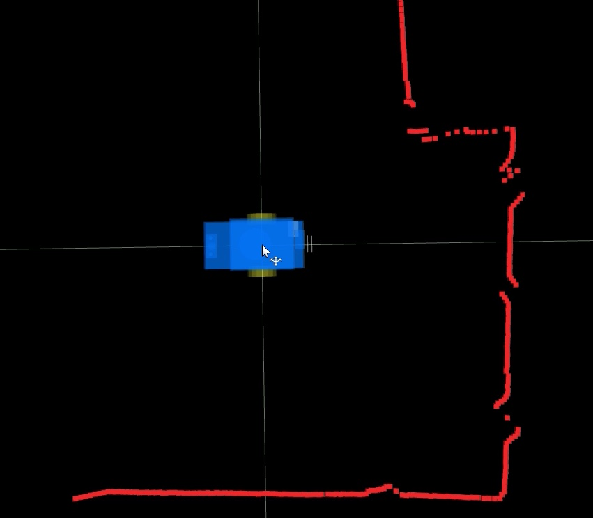
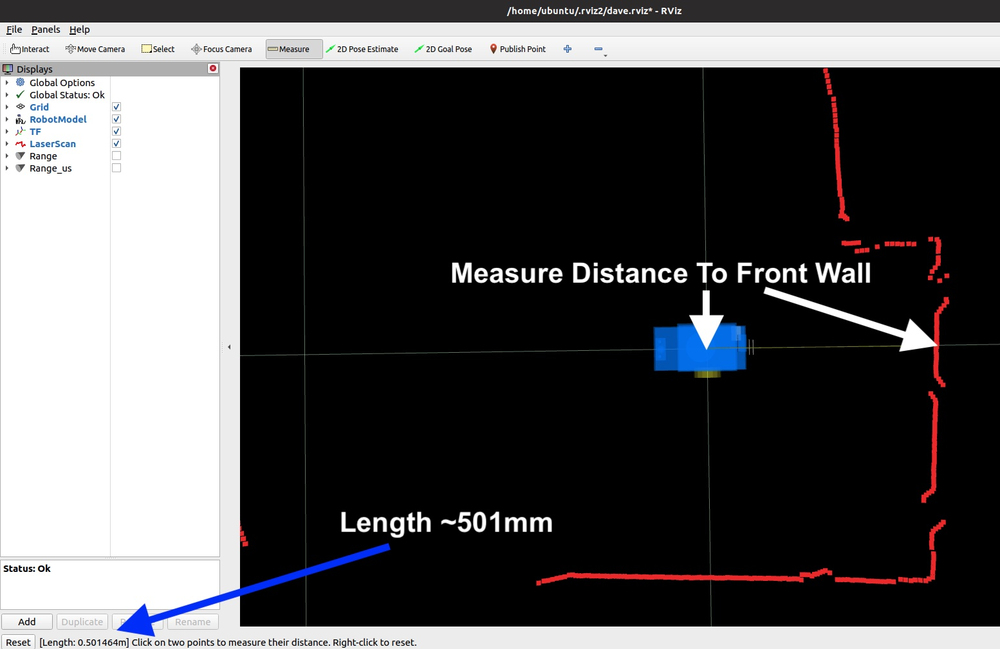
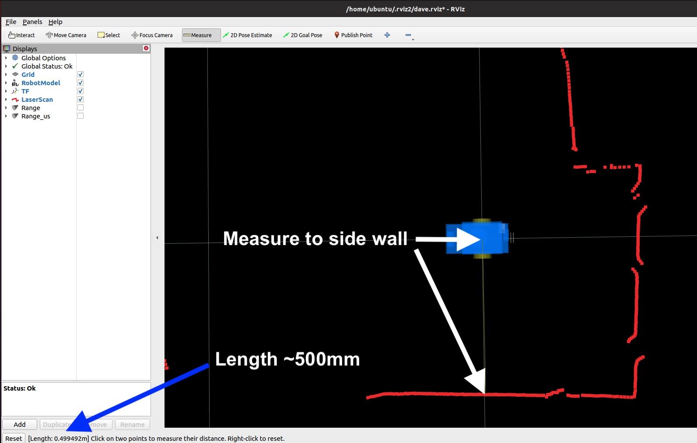

# Tuning the ROS2 GoPiGo3

The GoPiGo3 has a nominal WHEEL-DIAMETER of 66.5 mm and WHEEL-BASE-WIDTH of 117 mm  
but...  
Due to reality the effective wheel diameter and wheel base will be different.  

To have the most accurate encoder odometry, the effective values need to be determined and  
put in the JSON parameter file:  ```/home/pi/Dexter/gpg3_config.json```  

The first time your robot instantiates a GoPiGo3 or EasyGoPiGo3 class, the default values will be writen to the file.  


To view the file conveniently:  
```
python3 ~/systests/gpg_config/print_gpg3_config.py

or of course:

more /home/pi/Dexter/gpg3_config.json
```

# Finding effective WHEEL-DIAMETER

Use ```drive_1m.py``` and ```wheelBaseRotateTest.py``` to test and find the best WHEEL-DIAMETER value:
1) ```cd ~/systests/gpg_config```
2) Mark a starting location and 1 meter away
3) Assess the default value with ```./drive_1m.py```
4) Check the current gpg3_config.json content:  
```
ubuntu@ROS2HH:~/systests/gpg_config$ ./print_gpg3_config.py 
/home/pi/Dexter/gpg3_config.json contents:
   wheel-diameter  :  66.5
   wheel-base-width  :  117
   ticks  :  16
   motor_gear_ratio  :  120
```
(Your ticks value may be 6 or 16 depending on your particular GoPiGo3 serial number)

5) Refine WHEEL-DIAMETER value with ```./wheelDiaDriveTest.py```  
   Program begins:
```
ubuntu@ROS2HH:~/systests/gpg_config$ ./wheelDiaDriveTest.py 
Python Version: 3

Drive 100.0 cm with Wheel Dia.(66.50 mm) at 120 dps?  (? for help)
```
Note the default wheel diameter is displayed this first execution.  
- Place your ROS2 GoPiGo3 at the "starting line"  
- Press ```return or Enter key``` to perform the 1 meter drive again  
- If bot drove a little short of 1 meter:  
  Type ```w66.0```  (a slightly smaller value)  
- If bot drove a little long beyond 1 meter:  
  Type ```w67.0```  (a slightly larger value)  
- Place your bot back at the "starting line"  
- Press ```return or Enter key``` to perform the 1 meter drive again
- Repeat the wXX.XX and drive steps to find a repeatbly good value for the wheel diameter  
- When satisified with the value:  
  Type ```j``` to update the gpg3_config.json file with your effective wheel diameter value  
  Type ```q``` to quit   

6) Again print the gpg3_config.json file:  
```./print_gpg3_config.py```

# Finding effective WHEEL-BASE-WIDTH  
7) Refine WHEEL-BASE-WIDTH value with ```./wheelBaseRotateTest.py```  
   Program begins:  
```
ubuntu@ROS2HH:~/systests/gpg_config$ ./wheelBaseRotateTest.py 
Python Version: 3
***** wheelBaseRotateTest ******
wheel diameter and wheel-base read from /home/pi/Dexter/gpg_config.json

Spin 360 Wheel Dia:66.00 Base:117.00 mm?  (? for help)

```
Note the updated wheel diameter is displayed with the default wheel base value.  

- Place your ROS2 GoPiGo3 with one side of the body aligned with a floor board  
  or other straight line on the floor as a "heading reference" 
- Press ```return or Enter key``` to command a 360 degree spin in place  
- If bot rotated beyond 360 degrees:  
  Type ```b116.0```  (a slightly smaller value)  
- If bot did not turn a full 360 degrees:  
  Type ```b118.0```  (a slightly larger value)  
- Place your bot back aligned with the heading reference  
- Press ```return or Enter key``` to perform the 360 spin again  
- Repeat the bXXX.X and spin once steps to find a repeatbly good value for the wheel diameter  
- To test further type ```x10``` to execute 10 consecutive 360 degree turns to further refine your value  
  (Don't expect perfect every time.  Close is good.  **Dave's value for best x10 spins is 105.59 mm**) 
- When satisified with the value:  
  Type ```j``` to update the gpg3_config.json file with your effective wheel base value  
  Type ```q``` to quit   
- Again print the gpg3_config.json file:  
```./print_gpg3_config.py```  


# Verify URDF LaserScan Link to Base Link x,y  
[(Requires Desktop Visualization with rviz2)](ros2desk/ROS2_GoPiGo3_Visualization.md)  
1) Place bot square to a walled corner (suggest 50cm from front wall, 50cm from side wall)  
   - Measure distance from a front wall to center of wheels  
     Front Distance (wall to center of wheels) _____ mm   
   - Measure distance from side wall to center of bot between the wheels  
     Side Distance (wall to center of bot between wheels) _____ mm   
1) ./start_robot_xxxx.sh on robot  
2) Start rviz2, load RobotModel with robot_xxxx urdf  
3) Select rviz2:Move Camera  
  - mouse-drag down to be looking straight down on bot  
  - shift mouse to put grid-cross under the wheels in center of big yellow circle in center of window  
   
 
4) Select rviz2:Measure  
  - left click on grid crossing at center of bot  
  - left click on front wall scan dot on the grid line  
  - Note distance to front wall displayed in lower left  
    (This is base_link-to-laser_frame X-distance plus /scan distance: laser_frame to front wall)  
    Visualization Distance from center of bot (base_link) to front wall: ______ mm  
  

  - right click to reset/clear measurement  
  - left click on grid crossing at center of bot/grid cross  
  - left click on side wall scan dot on the grid line  
  - Note distance to side wall displayed in lower left  
    (This is base_link-to-laser_frame Y-distance plus /scan distance: laser_frame to side wall)  
    Visualization Distance from center of bot (base_link) to front wall: ______ mm  
   
 
  - If the displayed measurement is larger than the physical measurement,  
    decrease the appropriate x or y value (x to front wall, y to side wall)  
    in the robot's URDF file (~/ros2ws/src/ros2_gopigo3_node/urdf/xxxx.urdf and in ros2desk/xxxx.urdf  
    
    <joint name="joint_ydlidar" type="fixed">  
      <parent link="base_link"/>  
      <child link="laser_frame"/>  
      <origin xyz="-0.014 0 0.200" rpy="0 0 0" /> 
   
  - If the displayed measurement is smaller than the physical measurement,  
    Increase the appropriate x or y value (x to front wall, y to side wall)  
    in the robot's URDF file (~/ros2ws/src/ros2_gopigo3_node/urdf/xxxx.urdf and in ros2desk/xxxx.urdf     
  - ./rebuild.sh on the robot  
  - Load the new URDF file in rviz2, then click Reset button in lower left  
  - Retest measurements  
