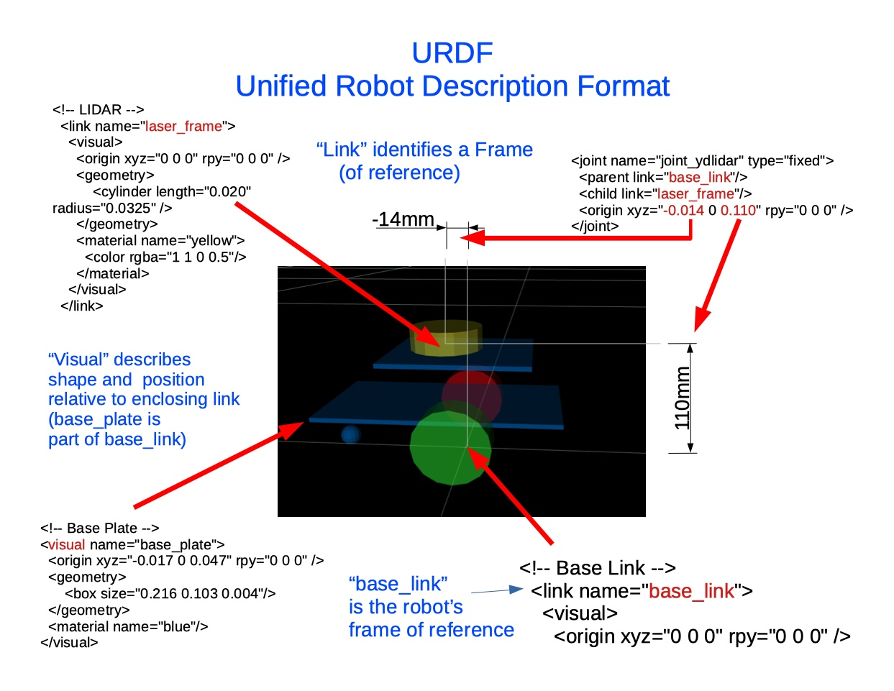
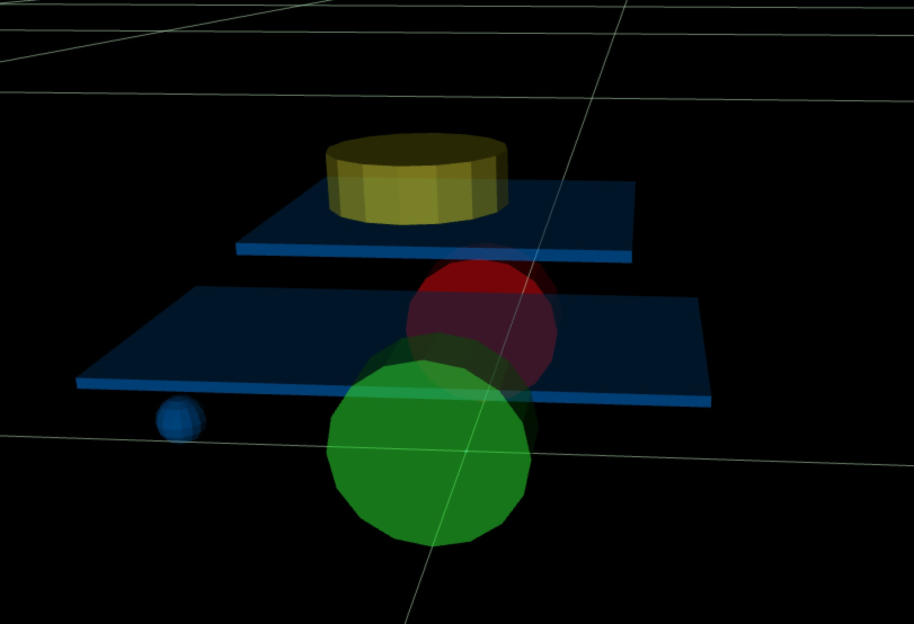
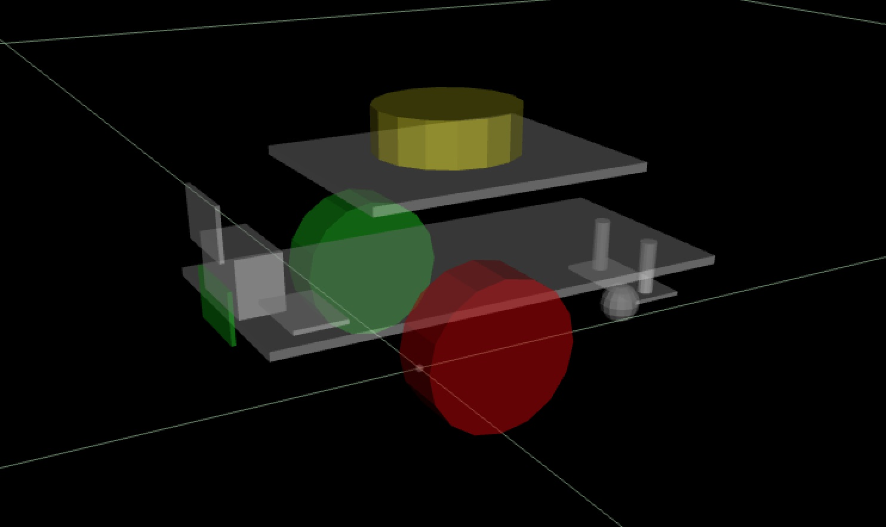
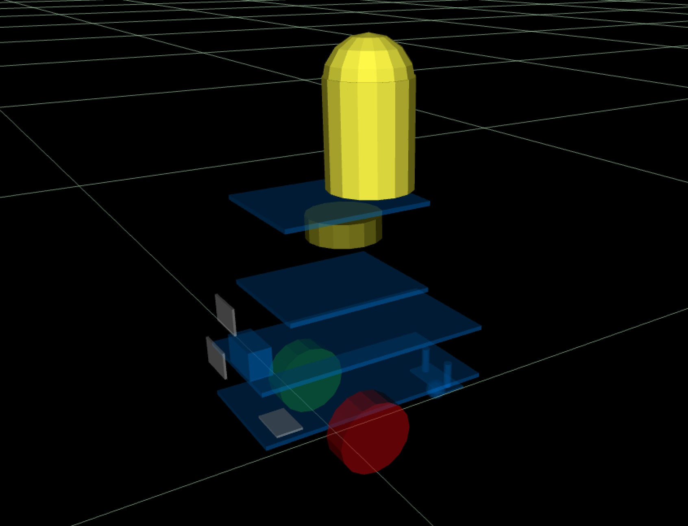
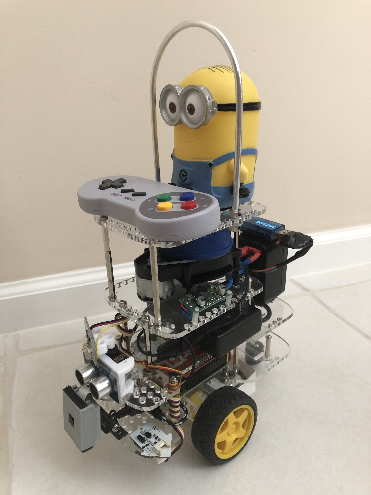
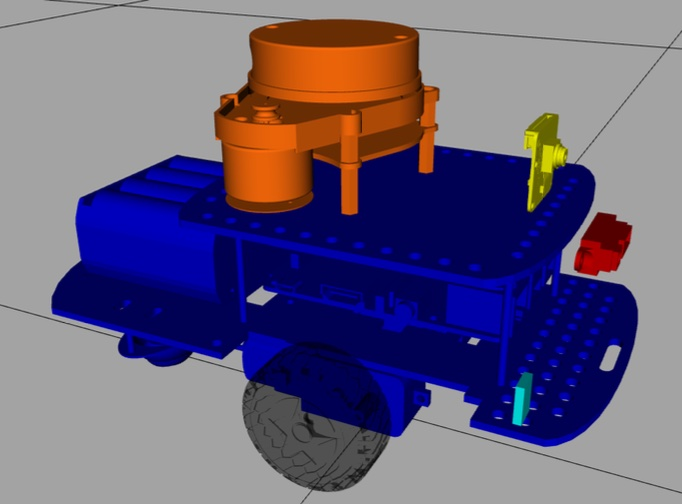

In ROS there are several standard XML format files to describe a robot  
(in terms ROS applications can understand):  

URDF: Unified Robot Description Format  
- xacro: XML Macro Language (allows complex elements to be summarized into URDF files)
- SDF: Simulation Description Format (primarily used by the ROS simulation tools)
- The URDF primarily describes:

  - the virtual “robot frame” established by the “base_link” element
  - the parts of a robot that make up the “base_link”
    where these parts are located in relation to the “base_link”
    the shape and size of the parts belonging to the base_link
  - the parts of a robot that have their own frame
    (with shape, orientation, reference point of the part)    
    * Left Wheel
    * Right Wheel
    * LiDAR: “laser_frame”
    * Servo
    * Distance/Ultrasonic Sensor
    * Bumper
  - Joints  
    define relation between “part frames” and the “robot frame”  
    degrees of freedom of a part - rotation about an some axis  

These are a few of the XML elements from the Minimal ROS2 GoPiGo3 URDF file gpgMin.urdf:  

  

Even if a GoPiGo3 robot does not have a LiDAR, ROS will know about the parts that do exist to keep track of where the robot (base_link / “robot frame” ) is in the world frame
- when the “odometry function” announces a change (in a /odom topic message)
(odometry comes only from encoders in the minimalist ROS2 GoPiGo3)

Part of a ROS robot builder’s responsibilities is to maintain a current and accurate robot description file. There are some tools to help, but I have not learned how to use them. I hand-built the sample gpgMin.urdf in a text editor. ( I did not even have XML element parsing assistance).

The gpgMin.urdf file includes an example LiDAR mounting position that would need to be corrected for the robot builder’s actual mounting of the LiDAR to the core GoPiGo3 robot.

These are the three URDF examples included in the ROS2 GoPiGo3 uSDcard image:

gpgMin.urdf  
  

finmark.urdf  
  

dave.urdf (no jokes please - I didn’t model Dave’s pants and his goggles)  
  

  
 

This is the URDF file of Bernardo R Japon, the author of the “Hands On ROS: ROS For Robotics Programming” showing the use of xacro to the fullest:  

  
