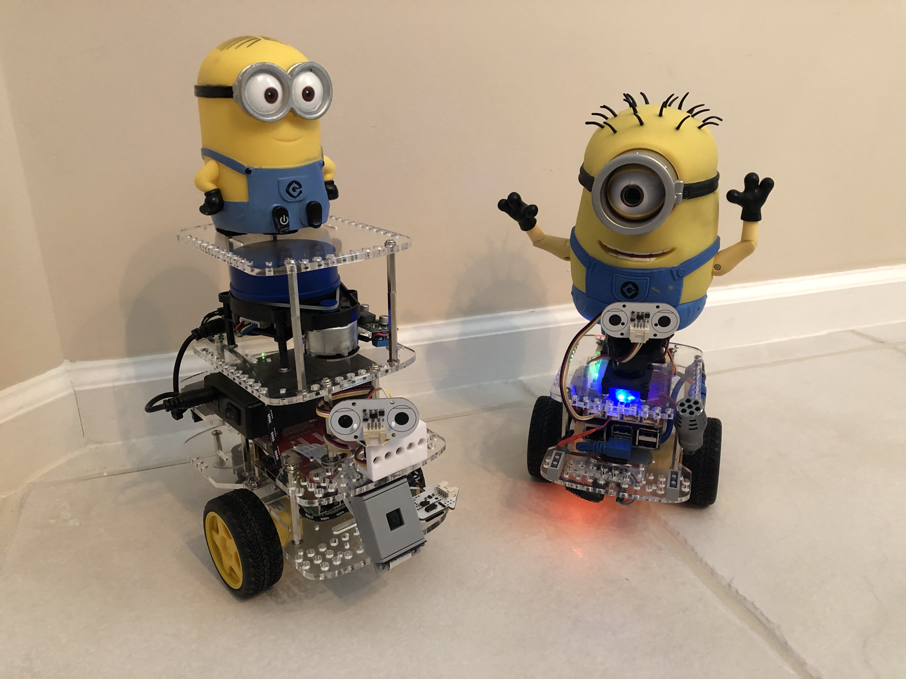

# Headless Setup For A ROS2 GoPiGo3 Robot

  
ROS2 GoPiGo3 robot Dave with GoPiGo3 robot Carl  

&nbsp;

[Get a GoPiGo3 robot here](https://gopigo.io/gopigo-core/)  

The ROS2 GoPiGo3 Image covers:  
  - Ubuntu 22.04 LTS Server (64-bit) on Raspberry Pi  
  - GoPiGo3 API and Drivers  
  - ROS2 Humble Hawksbill  
  - ROS2 for GoPiGo3 nodes and tools  
  - ROS2 Desktop Visualization

# Installation:  
1) [INSTALL FROM IMAGE](Docs/INSTALL_FROM_IMAGE.md) 

  

