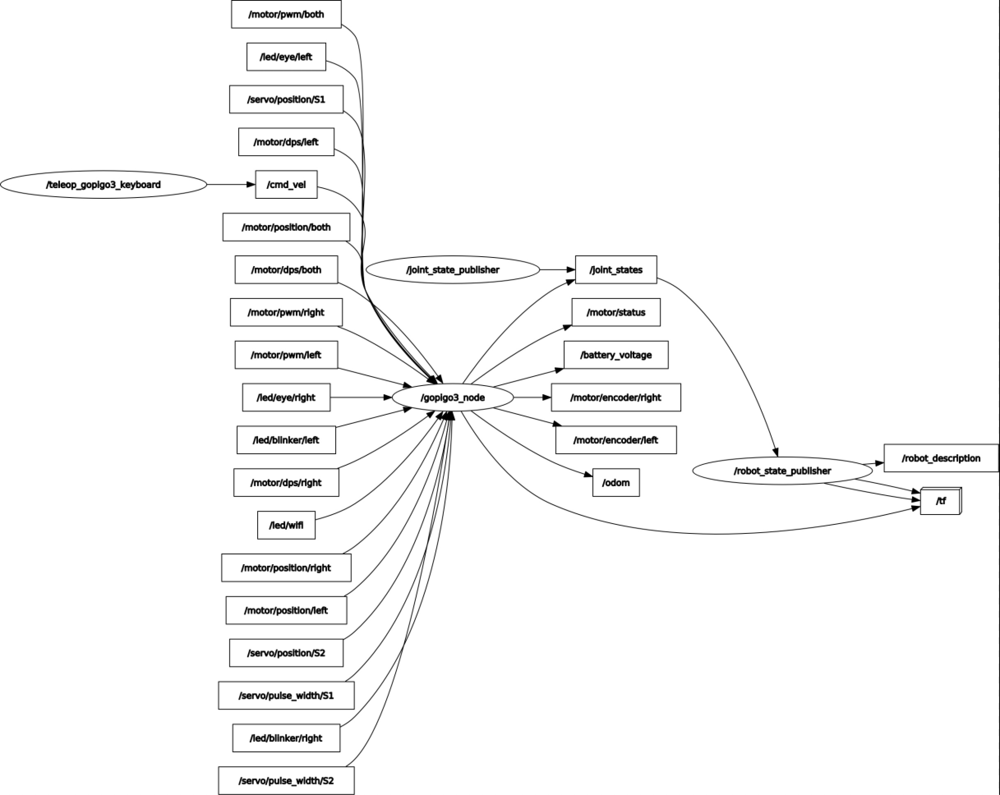
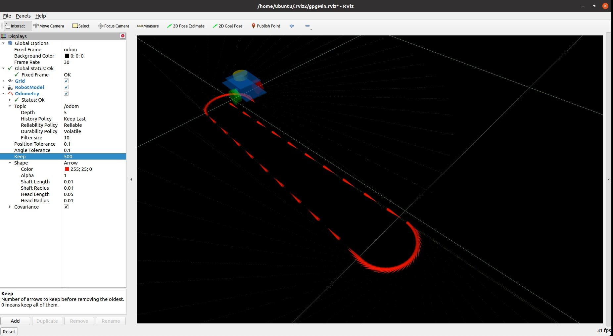
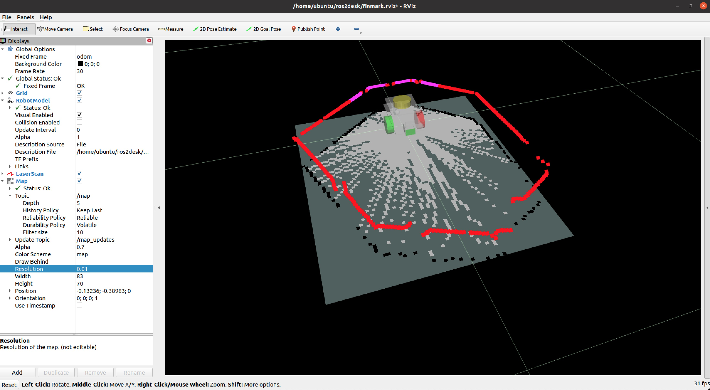
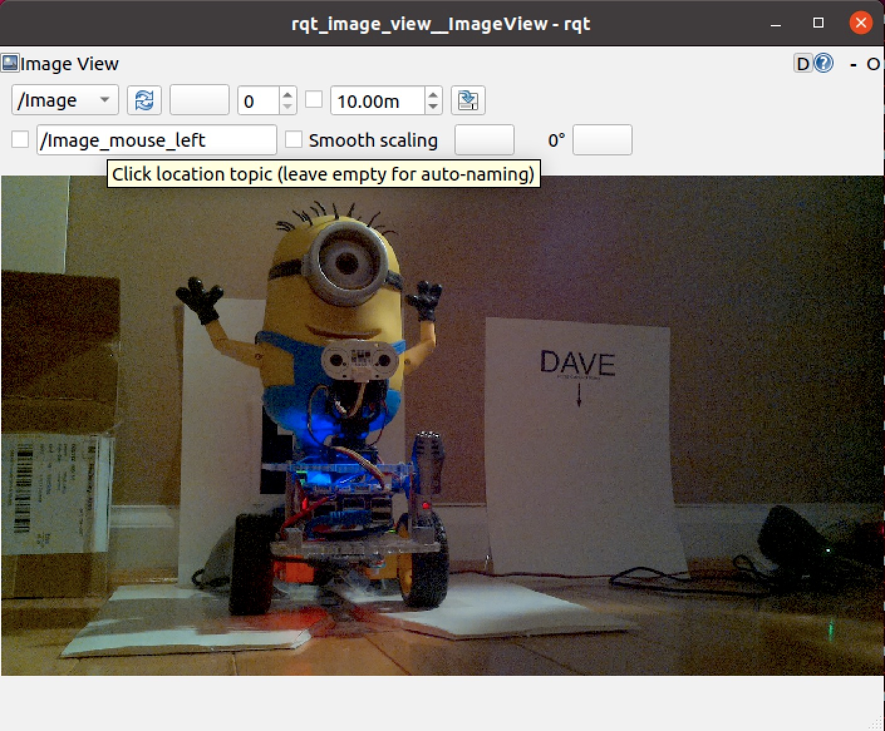

# ROS2 GoPiGo3 VISUALIZATION

## Get ROS2 GoPiGo3 Desktop Visualization Files
```
cd ~/ubuntu  
mkdir ros2desk  
cd ros2desk  
wget https://raw.githubusercontent.com/slowrunner/ROS2-GoPiGo3/main/ros2desk/get_ros2_gopigo3_desktop_visualization_files.sh  
chmod +x *.sh  
./get_ros2_gopigo3_desktop_visualization_files.sh  
```

&nbsp;  
&nbsp;  

## Using rqt_graph to view nodes and topics  
  


1) Install: ```sudo apt install ros-\<distro\>-rqt-graph```  
   ```e.g. sudo apt install ros-humble-rqt-graph```  
2) Type ```rqt_graph``` or ```show_rqt_graph.sh```  
3) Configure view and update  
  - Uncheck Hide: items  
    - Dead sinks  
    - Leaf topics  
    - tf  
    - Unreachable  
  - Click the "Refresh ROS Graph" button (upper left double circular arrows)  
  
&nbsp;  
&nbsp;  

## Using rviz2  
  

1) In first shell to ROS2 GoPiGo3 robot: Start ROS2 GoPiGo3 Robot nodes  
   - Minimal GoPiGo3:  ```./start_robot_gpgMin.sh```  
   - Finmark:  ```./start_robot_finmark.sh```  
   - Dave:  ```./start_robot_dave.sh```  

2) In second shell to ROS2 GoPiGo3 robot: ```./run_teleop_gopigo3_keyboard.sh```  

3) Start and configure rviz2 on ROS2 Desktop environment:  
  - Type ```rviz2``` in terminal window  
  - Click "Close Window" button of the right hand "Views" Panel  
  - Resize the "Displays" Panel to roughly half the RViz2 window  
  - Pull down Global Options:Fixed Frame option, change to odom, press return/enter key  
  - At the bottom of "Displays" panel, click "Add"  
    - Scroll down to see "RobotModel", click it, OK  
    - Pull down RobotModel:Description Source, change to File, press return/enter key  
    - Click in the right column of "Description File", three dots button will appear on the right  
      Click the three dots, dialog box appears, choose desired urdf file, click "Open" button upper right  
      Minimal GoPiGo3: gpgMin.urdf  
      Finmark: finmark.urdf  
      Dave: dave.urdf  
    - The robot model should appear in the grid window (Grid is 1 meter squares)  
    - Click in the grid window, then scroll down with mouse to zoom in on the robot with two or three meters around it  
  - Again at the bottom of "Displays" panel, click "Add"  
    - Double-click "Odometry"  
    - Expand the Odometry visualization line  
    - Click in the right column next to Topic  
      Pull down, and double-click /odom  
    - Expand "Shape"  
    - Change "Shaft Length", "Shaft Radius", and "Head Radius" each to 0.01  
    - Change "Head Length" to 0.05  

4) Move Robot around with teleop  
  - (Remember: Click in teleop_gopigo3_keyboard shell to issue key commands)  
  - SPIN "Left" CounterClockwise: ```j``` key, visualize robot spin in rviz2  
  - STOP: ```k``` or ```space bar```` to make robot stop  
  - DRIVE: Forward: ```i``` or Backward: ```, (comma)```  
  - To start again with the robot at a known starting point:  
    In shell to ROS2 GoPiGo3 robot (~/ubuntu/ros2ws): type ```./call_odom_reset_srv.sh```  
  - To clear the displayed path from rviz2:  
    Click the "Reset" button in the lower left corner of the rviz2 window  

&nbsp;  
&nbsp;  

5) SAVE RVIZ2 CONFIGURATION BEFORE QUITTING  
  - Pull down "File" menu, Click "Save"  
    (will save to ~/.rviz2/default.rviz in your Desktop/Laptop machine)  
  - Pull down "File->Save As..." 
    Navigate to your ros2desk folder (~/ubuntu/ros2desk)  
    Enter Name:   
    - Minimal GoPiGo3: gpgMin  
    - Finmark: finmark  
    - Dave: dave  
    - (Next time type: ```rviz2 -d gpgMin.rviz``` to launch using this file rather than the .rviz2/default.rviz)  

&nbsp;  
&nbsp;  

6) RVIZ2 FOR ROS2 GoPiGo3 ROBOTS w/YDKLidar X4:  
  

  - Add LaserScan: At bottom of "Displays" panel, click Add, Double-Click "Laser Scan"  
    - Expand LaserScan:Topic, Click to right of Topic and select /scan  
    - Set Reliability Policy to "Best Effort"  
    - Set Durability Policy to "Volatile"  
    - SAVE CONFIGURATION:  File->Save Config  
  - Add Map:  
    - In a Terminal Shell to the ROS2 GoPiGo: Start the slam-toolbox ```./start_slam_toolbox.sh```  
      (or uncomment the STARTING ROS2 SLAM-TOOLBOX section in your start_robot_xxxx.sh script)  
    - In Rviz2: At bottom of "Displays" panel, Click Add, Double-Click "Map"  
    - Expand Map:Topic, Click to right of Topic, and select /map  
    - Set Reliability Policy to "Best Effort"  
    - Set Durability Policy to "Volatile"  
    - Expand Map:Update Topic  
    - Set Reliability Policy to "Best Effort"  
    - Set Durability Policy to "Volatile"  
    - SAVE CONFIGURATION:  File->Save Config  

&nbsp;  
&nbsp;  

## Using rqt-image-view  


1) Install: ```sudo apt install ros-\<distro\>-rqt-image-view```  
   ```e.g. sudo apt install ros-humble-rqt-image-view``` 
2) Start image publisher ```./start_image_pub.sh``` on [u]ROS2 GoPiGo3[/u]  
3) Start rqt-image-viewer ```./run_image_view.sh``` on [u]desktop ROS2 environment[/u] 
4) ROS2 GoPiGo3 publishes a new image from the Pi Camera about once every 10 seconds  

NOTE:  If start_image_pub.sh throws an exception, may need to run ```libcamera-jpeg -o deleteme.jpg``` and then try again:
```
ubuntu@ROS2HH:~/ros2ws$ ./start_image_pub.sh 

*** Start Camera image pub Node
*** ros2 run ros2_libcamera_pub libcamera_jpg_pub

Traceback (most recent call last):
  File "/home/ubuntu/ros2ws/install/ros2_libcamera_pub/lib/ros2_libcamera_pub/libcamera_jpg_pub", line 33, in <module>
    sys.exit(load_entry_point('ros2-libcamera-pub', 'console_scripts', 'libcamera_jpg_pub')())
  File "/home/ubuntu/ros2ws/build/ros2_libcamera_pub/libcamera_jpg_pub.py", line 35, in main
    libcamera_jpg_pub = LibcameraJPGpub()
  File "/home/ubuntu/ros2ws/build/ros2_libcamera_pub/libcamera_jpg_pub.py", line 19, in __init__
    subprocess.check_output(['libcamera-jpeg --rotation 180 --brightness 0.1 --contrast 1.1 -o /home/ubuntu/ros2ws/src/ros2_libcamera_pub/image_to_pub.jpg'], stderr=subprocess.STDOUT, shell=True)
  File "/usr/lib/python3.10/subprocess.py", line 420, in check_output
    return run(*popenargs, stdout=PIPE, timeout=timeout, check=True,
  File "/usr/lib/python3.10/subprocess.py", line 524, in run
    raise CalledProcessError(retcode, process.args,
subprocess.CalledProcessError: Command '['libcamera-jpeg --rotation 180 --brightness 0.1 --contrast 1.1 -o /home/ubuntu/ros2ws/src/ros2_libcamera_pub/image_to_pub.jpg']' returned non-zero exit status 255.
[ros2run]: Process exited with failure 1


ubuntu@ROS2HH:~/ros2ws$ libcamera-jpeg -o x.jpg
Preview window unavailable
[0:07:15.576771418] [2844]  INFO Camera camera_manager.cpp:293 libcamera v0.0.0+4019-7c855784
[0:07:15.626273966] [2845]  INFO RPI raspberrypi.cpp:1414 Registered camera /base/soc/i2c0mux/i2c@1/ov5647@36 to Unicam device /dev/media0 and ISP device /dev/media1
[0:07:15.627509949] [2844]  INFO Camera camera.cpp:1026 configuring streams: (0) 1296x972-YUV420
[0:07:15.628053609] [2845]  INFO RPI raspberrypi.cpp:800 Sensor: /base/soc/i2c0mux/i2c@1/ov5647@36 - Selected sensor format: 1296x972-SGBRG10_1X10 - Selected unicam format: 1296x972-pGAA
[0:07:20.791637945] [2844]  INFO Camera camera.cpp:1026 configuring streams: (0) 2592x1944-YUV420 (1) 2592x1944-SGBRG10_CSI2P
[0:07:20.793938692] [2845]  INFO RPI raspberrypi.cpp:800 Sensor: /base/soc/i2c0mux/i2c@1/ov5647@36 - Selected sensor format: 2592x1944-SGBRG10_1X10 - Selected unicam format: 2592x1944-pGAA
Still capture image received


ubuntu@ROS2HH:~/ros2ws$ ./start_image_pub.sh 

*** Start Camera image pub Node
*** ros2 run ros2_libcamera_pub libcamera_jpg_pub
cv_image shape: (730, 1296)
[INFO] [1668269318.290716006] [LibcameraJPGpub]: Publishing an image
cv_image shape: (730, 1296)
[INFO] [1668269328.165649559] [LibcameraJPGpub]: Publishing an image
```
